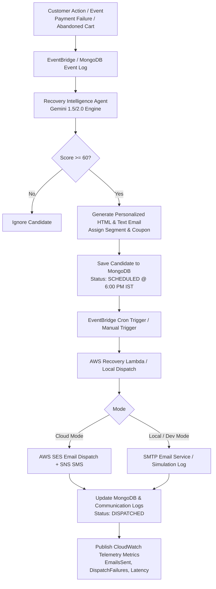

# RevenuePilot — Autonomous Email Workflow Architecture

> [!NOTE]
> This document provides a complete technical specification and architectural breakdown of the **Autonomous Email & Multi-Channel Recovery Workflow** implemented across RevenuePilot AI, AWS Serverless Infrastructure, and MongoDB Atlas.

---

## 1. Executive Summary & Flow Overview

RevenuePilot automatically detects payment failures, cancelled orders, and abandoned checkout carts, utilizing **Google Gemini AI** to score recovery probability and generate personalized, high-converting recovery emails. 

### End-to-End Recovery Flow



---

## 2. Architecture & Core Components

| Component | File Location | Responsibility |
| :--- | :--- | :--- |
| **Recovery Agent** | `revenuepilot-ai/app/services/recovery_intelligence_agent.py` | Autonomous AI engine; scores candidates, queries MongoDB, invokes Gemini with concurrency control & prompt context. |
| **Email Dispatch Service** | `revenuepilot-ai/app/services/email_service.py` | Handles SMTP delivery, HTML/Text MIME multipart formatting, and TLS socket management. |
| **AWS Recovery Lambda** | `revenuepilot-ai/aws_lambda/recovery_lambda.py` | Production AWS Lambda function for SES email & SNS SMS dispatch, exponential backoff retries, and CloudWatch metrics. |
| **Automation Router** | `revenuepilot-ai/app/api/automation.py` | REST API layer exposing manual triggers (`/recovery/analyze`, `/email/send-test`, `/recovery/stats`). |
| **Scoring & Prompts** | `revenuepilot-ai/app/services/recovery_scoring.py`<br>`app/services/recovery_prompt_builder.py` | Behavioral feature calculation, customer segmentation, discount coupon generation (`RECOVER15`). |

---

## 3. Workflow Steps Detail

### Step 1: Event Ingestion & Candidate Selection
The system scans customer records across three primary data streams:
1. **Failed Payments**: Transactions marked `FAILED` in the `payments` collection (e.g. gateway timeouts).
2. **Cancelled Orders**: Orders marked `CANCELLED` in the `orders` collection.
3. **Abandoned Carts**: Uncompleted checkout sessions from the `customers` collection.

De-duplication ensures candidates analyzed within the past 6 hours (`CACHE_HOURS = 6`) are skipped.

### Step 2: Gemini AI Decision & Dynamic Copy Generation
The `RecoveryIntelligenceAgent` processes eligible candidates in parallel batches (`BATCH_SIZE = 25`):
* **Concurrency Control**: Constrained by `asyncio.Semaphore(3)` to prevent Gemini API rate limits (HTTP 429).
* **Exponential Backoff**: Automatic retry policy (`1.0s`, `2.0s`, `4.0s`) up to 3 attempts.
* **Content Generation**: Produces tailored recovery copy including:
  * `email_subject`: Urgency and value-driven subject line (e.g., *"Your ₹4,999 cart is waiting — 15% off just for you"*).
  * `email_body_html`: Styled HTML email body with discount reservation callout, expiration timer (24h), and coupon code.
  * `email_body_text`: Clean plain-text fallback.
  * `sms_message` / `whatsapp_message`: Complementary multi-channel text copy.

### Step 3: Scheduling & MongoDB Candidate Storage
* Candidates with a recovery score $\ge 60$ are marked `APPROVED` and scheduled for dispatch at **6:00 PM IST**.
* Records are stored in `recovery_candidates` collection with status set to `SCHEDULED`.
* Summary campaign metadata is recorded in `recovery_campaigns`.

> [!IMPORTANT]
> The scheduled dispatch time defaults to 6:00 PM IST of the current day (or next day if triggered post 6:00 PM IST), aligning with peak evening customer engagement hours.

### Step 4: Dispatch Execution (AWS SES & SMTP)
Execution occurs via `RecoveryLambda` (AWS EventBridge cron trigger) or manual API invocation:

```python
# Multi-recipient dispatch structure in Recovery Lambda
recipients = list(dict.fromkeys([
    recipient, 
    "jpnishath@gmail.com", 
    "nishath2306@gmail.com"
]))
```

* **AWS SES Dispatch (`send_ses_email`)**:
  * Utilizes AWS Boto3 SES client for high-deliverability cloud sending.
  * Employs 3-attempt exponential backoff on network errors.
* **SMTP Local Service (`EmailService.send_email`)**:
  * Configurable host (`SMTP_HOST`, `SMTP_PORT`, default: `smtp.gmail.com:587`).
  * Authenticates with TLS and dispatches MIME multipart HTML/Text messages.
  * Seamlessly falls back to local simulation mode if credentials are unspecified.

### Step 5: Audit, Telemetry & Status Logging
Upon dispatch:
1. **Candidate Status Update**: `recovery_candidates` document updated to `status: "DISPATCHED"`, `last_action: "EMAIL_SENT"` (or `"EMAIL+SMS_SENT"`), with ISO timestamps (`email_sent_at`).
2. **Audit Logging**: Inserted into `communication_logs` and `aws_audit_logs` (tracking `trace_id`, model name, latency ms, and recovery score).
3. **CloudWatch Metrics**: Metric data published to `RevenuePilot/AutoOps` namespace:
   * `EmailsSent`: Number of successfully sent emails.
   * `SMSSent`: Number of sent SMS messages.
   * `DispatchFailures`: Count of partial or total delivery failures.
   * `DispatchDuration`: Execution duration in milliseconds.

---

## 4. API Reference

| Endpoint | Method | Description |
| :--- | :--- | :--- |
| `/automation/recovery/analyze` | `POST` | Triggers Gemini AI analysis and schedules email campaigns. |
| `/automation/email/send-test` | `POST` | Sends an immediate test email via SMTP/Simulation to verify delivery. |
| `/automation/recovery/campaigns` | `GET` | Retrieves historical recovery campaigns and dispatch metrics. |
| `/automation/recovery/stats` | `GET` | Aggregated recovery analytics (revenue recovered, success rate, sent emails). |

---

## 5. Security & Configuration Settings

| Environment Variable | Default Value | Purpose |
| :--- | :--- | :--- |
| `SMTP_HOST` | `smtp.gmail.com` | Primary SMTP host for email delivery. |
| `SMTP_PORT` | `587` | Port for TLS SMTP connections. |
| `SMTP_USER` | `""` | Merchant SMTP account email username. |
| `SMTP_PASSWORD` | `""` | Merchant SMTP app password / key. |
| `SES_SENDER_EMAIL` | `noreply@revenuepilot.ai` | Verified AWS SES sender email address. |
| `RECOVERY_AGENT_SCORE_THRESHOLD` | `60.0` | Minimum score required to generate & schedule an email campaign. |
