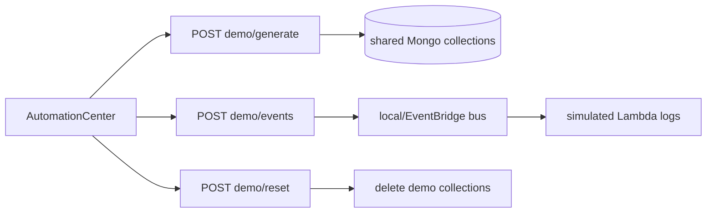
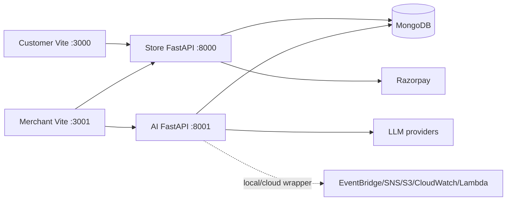
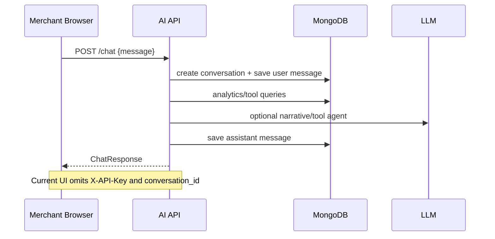
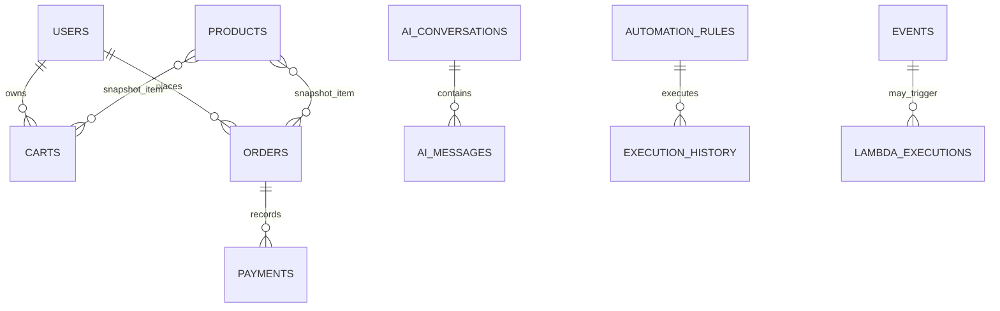
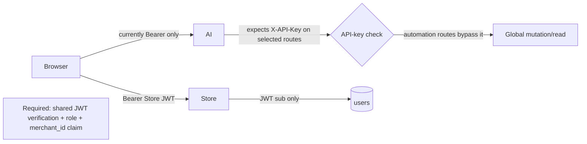
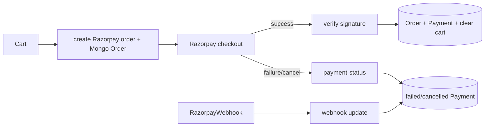
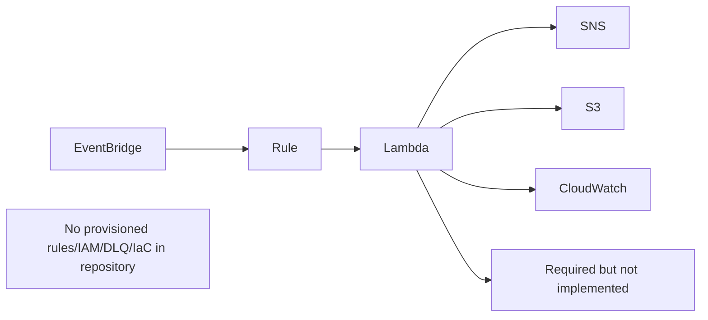

# RevenuePilot Production Engineering Audit

**Audit date:** 2026-08-30  
**Method:** static source review of all tracked application/config/test files (excluding generated lockfiles and binary assets), route/API/button cross-reference, dependency/config review, and production builds. Merchant and store frontends both built successfully. Python test suites were **not executed** because the available interpreter (`C:\Python313\python.exe`) has no `pytest` installed; this is not a test pass. No running MongoDB, Razorpay, AWS, or LLM environment was available, so integration behaviour is source-verified, not live-verified.

## 1. Repository Architecture

The repository is a four-process monorepo:

```text
Razorpay/
├─ run_local.py                         # starts all local processes
├─ AUTOMATION_CENTER_README.md          # AutoOps UI/feature narrative
├─ revenuepilot-store/                  # transactional ecommerce system
│  ├─ backend/                          # FastAPI + Beanie/Mongo + Razorpay
│  │  └─ app/{core,db,models,schemas,routers,services,middleware,api}
│  ├─ frontend/                         # customer React/Vite storefront
│  ├─ tests/                            # store API/payment/webhook tests
│  ├─ docker-compose.yml                # store frontend/backend only
│  └─ .github/workflows/ci.yml          # store-only CI
├─ revenuepilot-merchant/frontend/      # merchant React/Vite operations console
└─ revenuepilot-ai/                     # FastAPI analytics/AI/automation service
   ├─ app/{api,agents,llm,services,tools,models,db,core,middleware,prompts}
   ├─ aws_lambda/                       # standalone Lambda handler source
   ├─ scripts/                          # mutable demo/seed scripts
   └─ tests/                            # partial AI/AWS/unit tests
```

`run_local.py` launches Store API on 8000, AI API on 8001, Store Vite on 3000, and Merchant Vite on 3001. The customer frontend calls `/api/v1` Store API. The merchant frontend calls **both** Store API and AI API. Both FastAPI services point at the same default database, `revenuepilot_store`.

Important source groups:

| Area | Files/purpose |
|---|---|
| Store entry/config | `backend/app/main.py`, `core/config.py`, `db/mongodb.py`; initializes Beanie, seeds products/users, routes and CORS. |
| Store domain | `models/{user,product,cart,order,payment,webhook}.py`; Pydantic/Beanie persistence. `schemas/*.py` form the API contract. |
| Store behaviour | `routers/{auth,products,cart,checkout,webhooks,merchant}.py`; `services/razorpay.py` wraps gateway; `services/seed.py` creates demo/default records. |
| Customer UI | `frontend/src/App.tsx`, pages, components, Zustand `authStore`/`cartStore`, Axios service modules. |
| AI entry/config | `revenuepilot-ai/app/main.py`, `core/config.py`, `db/mongodb.py`; connects Motor, registers APIs. |
| AI behaviour | `services/analytics.py` (large Mongo aggregation/query module), merchant/recovery/watchdog/automation/demo/report/AWS services; `agents/coordinator.py` routes prompts. |
| AI providers | `llm/{openai,gemini,grok}_provider.py`, factory/provider abstractions. |
| Merchant UI | `frontend/src/App.tsx`, route pages, layout/components, Axios service facade and persisted Zustand auth state. |

Environment flow: Store settings load `.env` from its backend working directory and include unsafe defaults. AI loads `revenuepilot-ai/.env` explicitly and also contains unsafe defaults. Vite exposes `VITE_*` configuration at build time. Docker Compose only injects `revenuepilot-store/.env`; it neither deploys AI nor merchant UI. The only tracked CI workflow covers the Store app.

Request lifecycle: Browser → Axios interceptor (Bearer token) → Store API dependency validates Store JWT → router → Beanie/Mongo/Razorpay. Merchant browser → Axios interceptor (same Store JWT) → AI API; however, protected AI endpoints require an `X-API-Key`, which the interceptor never supplies. Automation endpoints bypass all authentication entirely.

Authentication lifecycle: Store registration/login creates a 24-hour HS256 JWT containing only `sub`; it is retained in localStorage. Merchant UI calls `/auth/me`, but Store `UserOut` has no role, so merchant UI silently assigns `merchant`. There is no server-side role/tenant assertion.

## 2. Application Navigation Audit

All merchant pages are nested below `ProtectedRoute` and `DashboardLayout`; customer protected pages use a component wrapper. There are no React contexts; state is Zustand/local state and a largely unused React Query provider.

| App path | Entry component/layout | Calls/state/access |
|---|---|---|
| Store `/` | `LandingPage`, `Navbar`, `Footer` | links; public |
| `/products` | `ProductsPage` | products/categories/search; local filters; public |
| `/products/:id` | `ProductDetailPage` | product + cart store; public view, auth for cart mutation |
| `/cart` | `CartPage` | cart Zustand; sends unauthenticated shopper to login; public route |
| `/checkout` | `ProtectedRoute > CheckoutPage` | cart, Razorpay SDK, create/verify/status APIs; authenticated |
| `/orders` | `ProtectedRoute > OrdersPage` | user orders and cancellation status call; authenticated |
| `/login`, `/register` | `LoginPage`, `RegisterPage` | Store auth API; public |
| `/profile` | `ProtectedRoute > ProfilePage` | persisted auth state only; authenticated |
| Merchant `/login` | `LoginPage` | Store `/auth/login`; public |
| Merchant `/` | `ProtectedRoute > DashboardLayout > DashboardPage` | AI insights + Store summary; intended merchant/admin but server cannot enforce |
| `/automation` | same layout > `AutomationCenter` | unauthenticated AI automation actions/data |
| `/copilot` | same layout > `CopilotPage` | AI chat/conversation APIs |
| `/reports`, `/revenue`, `/orders`, `/payments`, `/inventory`, `/recovery`, `/customers`, `/forecast`, `/incidents`, `/webhooks`, `/settings` | same layout > named page | respective Store/AI metrics and action APIs |
| `*` merchant | `Navigate('/')` | masks invalid/deep-link route errors |

Navigation map: `Sidebar` supplies the merchant destination links; `TopNav` refreshes; customer `Navbar` links landing/products/cart/profile/login and `ProductCard` navigates product detail. No page implements an authorization policy beyond client redirect.

## 3. Complete Button Audit

The following is the static inventory of every action-bearing UI control, including cards/tabs/dialog controls. `API` is the actual client call; **local** means no network/database effect. Most pages use `react-hot-toast`; Store pages predominantly render inline errors/no toasts.

| Location / control | Handler → API/payload | State / outcome / audit result |
|---|---|---|
| Store Navbar: Logout | `handleLogout` → local auth logout, `/` | clears token; works client-side. |
| ProductCard: Add to cart | `handleAddToCart` → cart store `POST /cart/items {product_id,quantity:1}` | stops navigation, no visible success/error feedback; needs auth. |
| Products: search, category filters, clear | submit/inline setters → `GET /products/search?q`, `GET /products?category` | local loading/error; clear refetches. |
| Product detail: ± quantity, Add | setters; cart store POST | no stock/max validation; add has store error state. |
| Cart: Clear, −, +, remove, checkout | cart store DELETE/PATCH/DELETE; route transition | controls lack mutation pending disable; concurrent clicks can reorder stale responses. |
| Checkout: Back, Pay, Cancel | navigation; `POST /checkout/create-order {}`, Razorpay SDK then verify; `POST /checkout/payment-status` | payment UI uses loading/failure/cancel states; cancel marks order terminal. Server ownership flaw makes it critical. |
| Customer orders: Cancel payment | `POST /checkout/payment-status {razorpay_order_id,payment_status:'cancelled'}` | visually available for pending orders; server does not verify owner. |
| Login/Register submit | auth POST payload form values | HTML required only; no password policy/client normalization; errors inline. |
| Merchant Sidebar: nav and Logout; Collapse | `NavLink`; logout/navigate; local setter | navigation works; logout no server revoke. |
| Merchant TopNav: refresh | `handleRefresh` health checks then parent refresh | useful loading status; bell icon is a **dead button** (no handler/ARIA). |
| Dashboard: refresh, period chips | refresh calls 5 APIs; local selected period | period changes only presentation/chart selection, not server query. |
| All metric pages (`Revenue`, `Customers`, `Forecast`, `Inventory`, `Payments`, `Orders`, `Incidents`, `Webhooks`) Refresh | local `loadData` calling AI metrics | works only while AI API key disabled; no X-API-Key supplied. |
| Inventory/Payments tabs | `setActiveTab` | local filter only. |
| Merchant Orders/Webhooks rows and close dialogs | `setSelectedOrder/Webhook`, close setters | detail opens correctly; modal "View" buttons have **no `onClick`** (dead) at Orders:124 and Webhooks:133. |
| Incidents Resolve | `handleResolve` → local set of resolved IDs | **dead persistence:** no endpoint/database write, so reload restores incident. |
| Recovery tabs, Copy WhatsApp/Email, Mark Sent | local tab; Clipboard API; local `sent` Set | mark-sent is **not a campaign send**, has no backend audit; Clipboard failure is not handled. |
| Reports date chips, CSV/JSON/PDF, downloads | state; `POST /automation/reports/generate`; direct `window.open` download URL | generation has loading/error toast; generated report content is served without auth. |
| Settings: demo toggle, quick seed/reset, Save, Diagnostics | calls `/automation/demo/toggle`, generate/reset; local Save; health calls | **broken:** `demo/toggle` does not exist. Save only toasts and persists nothing. Seed/reset are destructive unsecured operations. |
| Copilot: show/hide timeline, prompt chips, new/delete conversation, send/Enter | local; automation conversation APIs; `POST /chat {message}` | send does not pass `conversation_id`, so server creates a new conversation per message; conversation history is not used as LLM context. |
| CopilotSidebar: New/select/delete | parent callbacks; DELETE conversation | no confirmation/undo, server deletes only conversation metadata (see §9). |
| SchedulerPanel: Refresh/toggle/run | schedule GET/POST | backend controls schedules synchronously and unauthenticated. |
| WatchdogDashboard: inventory/popularity/refresh | POST watchdog endpoints/GET dashboard | triggers global mutations/jobs synchronously; no role confirmation. |
| HealthScore, ExecutionHistory, CloudWatch cards: Refresh | GET endpoint | no mutation. |
| EventTimeline: category/refresh/row expansion | local/GET timeline/local | detail disclosure works; category regex is user-supplied but UI constrained. |
| AutomationCenter: AWS service test, refresh | POST AWS test / data load | unsecured infra probe. |
| AutomationCenter demo commands: Generate 30 days, Simulate, Watchdogs, Schedulers, Lambdas, Reports, Reset | respective `/automation/demo/*` POSTs | all perform global writes; `Reset` has no confirmation and wipes named collections. |
| AutomationCenter tabs/metric chips/campaign card/close | local setters | campaign card opens dialog; several close controls are local only. |
| AutomationCenter campaign CTA at line 1264 | none | **dead `<button>` with no handler**. |
| AutomationCenter Emit test event | `POST /automation/test-event` | global simulated event write; no validation beyond server `Dict`. |

General button findings: handlers are connected for primary checkout, reports, watchdog, and demo actions, but their service contract/security is insufficient. There is no centralized action registry, idempotency key, permission gate, confirmation, audit trail displayed to the user, or consistent disabled-while-pending rule. Buttons do not trigger analytics events. No actual background queue is invoked; calls run in the request process.

## 4. End-to-End Workflow Audit

**Customer purchase:** Product page → cart POST (server snapshots client-selected product price from DB) → checkout creates Razorpay order and Store order → Razorpay modal → client verify API → signature verified → Order/Payment written, cart emptied → orders navigation. Failure/cancel writes terminal state. Defects: order creation accepts client `items` with arbitrary price/quantity; verification and cancellation find an order globally and never compare `order.user_id` to `current_user.id`; webhook can overwrite terminal state and does not append payment event.

**Merchant sign-in:** Merchant login → Store auto-provisions allowlisted email with whatever submitted password or rewrites its password hash → JWT stored → `/auth/me` returns no role → UI assigns merchant → routes render. This is authentication bypass for the three allowlisted addresses.

**Dashboard:** mounted `DashboardPage` executes insights today/week/month/inventory plus Store summary in parallel; state/chart transforms update. Every protected AI metric fails with 401 when `API_SECRET_KEY` is set, since no `X-API-Key` is sent. If unset, the AI API protection is deliberately disabled.

**Copilot:** UI POST `/chat`; API independently creates/saves conversation/message, coordinator classifies intent and invokes analytics/tool agents, optional LLM generates narrative, saves response. Returned client response omits a reliable conversation ID and client never passes one, so selection/history does not map to future chat requests. No tenant association comes from verified user identity.

**Demo/AutoOps:** AutomationCenter POST generates demo data or invokes watchdog/scheduler/lambda/report methods → Motor writes shared collections / local AWS fallback artifacts/events → UI reloads feeds. All actions are in-process synchronous and unauthenticated, with no queue, progress protocol, cancellation, job ownership, or transaction boundary.

**ZIP upload:** not implemented. No `UploadFile`, `File`, `zipfile`, extraction, S3 upload API, progress UI, polling, or job collection exists. Any claimed ZIP workflow is absent from this repository.

## 5. API Audit

Store router surface (prefix `/api/v1`):

| Method/routes | Auth / schema / stores | Audit |
|---|---|---|
| POST `/auth/register`, `/auth/login`; GET `/auth/me` | public `UserRegister`/`UserLogin`; JWT for me; `users` | email format only; no rate limit per account, password strength, lockout, role. Login auto-provisions allowlisted accounts. |
| GET `/products`, `/products/categories`, `/products/search`, `/products/{id}` | public query params; `products` | `limit` unbounded/negative and regex search interpolates user text (ReDoS); categories reads all docs. |
| GET/POST/PATCH/DELETE `/cart[ /items/{product_id}]` | Bearer; cart schemas; `carts`, `products` | no quantity bounds or stock enforcement; race-prone read-modify-save. |
| POST `/checkout/create-order`, `/verify-payment`, `/payment-status`; GET `/orders`, `/orders/{id}` | Bearer; checkout schemas; orders/payments/carts/Razorpay | no item/amount/owner validation in three mutation lookups; no idempotency; per-request gateway call. |
| POST `/webhooks/razorpay` | Razorpay signature; body; orders/payments/webhook_events | duplicate lookup/write race; webhook terminal-state regression; no durable retry/DLQ. |
| GET `/merchant/{orders,payments,customers,revenue-summary,summary,events}` | **none**; global collections | PII and full financial data publicly exposed; N+1 queries; unbounded summary. |

AI router surface: `/health` is public. `/chat`, `/insights/*`, and `/merchant/*` depend on an optional shared `X-API-Key`; all **`/automation/*` routes (schedules, watchdogs, recovery, AI memory, lambdas, events, reports, rules, observability, simulation, all demo endpoints) have no authentication or authorization**. Requests are mostly untyped `Dict[str, Any]`; status/error schemas and rate limits are absent. Endpoint aliases are redundant (`/schedules/run-now/{id}` and `/schedules/{id}/run`; toggle variants). `POST /automation/demo/toggle` is called by the frontend but is not implemented.

No API enforces merchant tenancy. Query parameters such as `merchant_id`, conversation IDs, report filename, schedule/rule IDs, and payload fields are trusted. Return types are inconsistent: selected endpoints use Pydantic response models, most automation routes return ad hoc dictionaries. Expected validation errors are FastAPI default 422; operational error/status contracts are undocumented.

## 6. Frontend Component Audit

All components were inspected. The structural components are `DashboardLayout` (Sidebar, TopNav, Outlet), `ProtectedRoute`, `Navbar`, `Footer`, product card, six data cards (`CloudWatchMetrics`, `EventTimeline`, `ExecutionHistory`, `HealthScoreCard`, `SchedulerPanel`, `WatchdogDashboard`), `CopilotSidebar`, KPI/chart components and all listed pages. They use functional React components and hooks; none receives a central typed domain model.

Repeated issues across pages: `any` response state (`DashboardPage` and nearly all merchant metric pages), duplicated fetch/loading/error implementations, no `AbortController`/request sequencing, manually managed state despite a QueryClient, no query cache invalidation, and endpoint errors often collapsed to empty dashboard values. Chart components accept `any[]`, are not memoized, and have no accessibility summary/table alternative. Tailwind dark styling is hard-coded; there is no theme state or light-mode support.

Accessibility defects: icon buttons lack accessible names (TopNav bell, password visibility), several clickable cards/rows use `onClick` without keyboard semantics, modals lack focus trapping/escape handling/ARIA dialog labelling, status colors convey meaning without text in places, and forms do not reliably connect error text with inputs. Responsive classes exist but wide tabular/detail UIs have no documented mobile overflow strategy.

## 7. Form Audit

| Form | Fields/validation | Finding/fix |
|---|---|---|
| Store registration | name, email (`EmailStr` server), phone, password; HTML required | no length/phone/password policy, duplicate email check races. Add server Pydantic constraints, unique-index error handling, normalized email, password policy. |
| Store login / Merchant login | email, password; HTML required | merchant privilege derives from arbitrary user content/default, not a server role. Add role field/claims and RBAC dependency. |
| Product search | text; query requires min length 1 | escape regex (`re.escape`), max length, debounce and limit results. |
| Checkout | no address/shipping/tax form; Razorpay modal | price/order inputs must originate server cart only; verify ownership/state atomically. |
| Automation payloads | hidden/inline values and `Dict` bodies | replace every `Dict[str, Any]` with strict Pydantic schemas, bounds (`days/orders/customers/products`), permission and idempotency checks. |
| Settings | demo toggle and local save controls | setting fields are presentation only; implement versioned merchant preferences or remove. |

## 8. Database Audit

Store Beanie collections: `users`, `products`, `carts`, `orders`, `payments`, `webhook_events`. Unique/indexed fields include user email, product ID/category, cart user ID, order IDs/user ID/Razorpay ID, payment IDs/order ID, webhook event ID. AI additionally reads/writes `customers`, `events`, `automation_rules`, `automation_schedules`, `execution_history`, `incidents`, `recoveries`, `coupons`, `recovery_campaigns`, `recommendations`, `business_health_history`, `ai_conversations`, `ai_messages`, `merchant_ai_preferences`, `reports`, `generated_reports`, `lambda_executions`, and demo/observability collections.

The AI index initializer creates only orders user/payment status, payments status/order ID, products category, and carts user. It omits high-volume sort/filter compounds: `orders(payment_status,created_at)`, `payments(status,created_at)`, `events(timestamp)`, `ai_messages(conversation_id,timestamp)`, `ai_conversations(merchant_id,updated_at)`, schedule/rule IDs, reports filename/created_at, and TTL for events/logs/generated demo data. No model owns most AI collections, resulting in schema drift and no Mongo-level tenant boundary. `analytics.py` materializes up to 10,000 documents in several paths; Store summary materializes all orders.

## 9. Backend Service Audit

`RazorpayService` wraps creation/signature/webhook verification, but payment mutation lacks database transaction/idempotency. `analytics.py` is 1,176 lines of mixed aggregation, query, forecast, and presentation logic: split by bounded contexts and add repository methods/metrics. `merchant_service.py` is a second large aggregation/facade layer, creating duplication. `automation_engine`, `scheduler`, `watchdog`, `recovery`, `demo_data`, and cloud bus services mutate globally in the API process; their names imply durable asynchronous infrastructure that does not exist.

`ai_memory_service.delete_conversation` deletes the conversation document but not `ai_messages`, leaving orphaned sensitive content. `reports_service` stores full report content twice (`reports` and `generated_reports`), consuming Mongo memory and lacking retention. AWS clients catch failures and fall back locally, which is useful for demos but dangerous in production because a cloud failure can look successful. Exceptions are widely caught as `Exception`, sometimes discarded (`_ensure_indexes`), preventing actionable failure handling.

## 10. AI & ML Audit

The coordinator has specialist agents (revenue, payment, inventory, recovery, customer, forecast) and provider factory support for Gemini/Grok/OpenAI; providers use a 30s `httpx` request and do not stream. Prompts provide domain roles, but there is no token budget, request quota, model timeout policy beyond HTTP timeout, content moderation, prompt-injection boundary, PII minimization, conversation-context injection, response provenance enforcement, or cost telemetry. The chat error path silently returns analytics fallback as an AI-shaped answer.

Recommended additions: a versioned feature store from paid orders/payments/customer events; nightly offline training with backtesting and drift metrics; prediction APIs that return confidence/feature timestamp/model version. Integrate revenue/demand forecast in `merchant_service.get_forecast_metrics_detailed`; churn/payment failure scores in recovery/watchdog; anomaly/fraud score before payment/recovery triggers; RFM merchant/customer segmentation in customer analytics. Do not use an LLM as a numerical forecaster—use validated time-series/classification models and let the LLM narrate constrained outputs.

## 11. AWS Architecture Audit

`aws_client.py`, EventBridge/SNS/S3/CloudWatch wrappers and five Lambda handler files model AWS interactions. They use credentials from environment/static names and a local fallback. There is **no** Terraform/CDK/CloudFormation, Lambda packaging/deployment definition, IAM role/policy, EventBridge rule, SNS subscription, DLQ, ECR service, Secrets Manager reference, VPC/network design, alarm, retention setting, or production deployment workflow. The Store Docker Compose does not include the AI service or MongoDB. Lambda modules create boto3 clients at import time and handlers have no consistent schema/partial-failure/idempotency contract.

Required data flow should be: API outbox → EventBridge with event ID → rule → Lambda → idempotent Mongo/S3/SNS action → DLQ on retry exhaustion → CloudWatch metric/alarm. Use task roles/Secrets Manager, least privilege per Lambda, KMS S3/SNS encryption, presigned downloads, audit log retention, and an explicit `AWS_MODE=cloud` deployment guard that fails closed.

## 12. Demo Mode Audit

`demo_data_service.py` generates products/customers/orders/payment/events for default merchant and supports seed, today activity, synthetic events, watchdog/scheduler/lambda/report calls, feeds, summary and reset. `/demo/status` always returns `demo_mode: true`; no toggle endpoint/state exists. Parameter integers are unbounded and unvalidated, so a caller can request resource exhaustion. Reset imports a script that clears demo collections without tenant scoping, confirmation, backup, or transaction. Random data is not described as deterministic/seedable; repeat runs can contaminate production collections because it uses the same configured database.



## 13. Security Audit

| Severity | File / component | Why/root cause / user + technical impact / recommended fix |
|---|---|---|
| Critical | `revenuepilot-ai/app/api/automation.py` | Every automation, demo reset/seed, reports, conversations, schedule, Lambda and AWS test route has no dependency. Any network caller can destroy data, trigger actions, read data, or probe infrastructure. Add Store JWT verification, server-side merchant/admin RBAC and tenant filters to router-level dependencies; separate internal worker credentials. |
| Critical | `revenuepilot-store/backend/app/routers/merchant.py` | All merchant financial/customer endpoints are public. Exposes PII/order/payment data. Require admin/merchant auth and tenant scope; paginate with capped bounds. |
| Critical | `routers/auth.py:38-67` | Allowlisted email missing user is created with attacker-supplied password; existing allowlisted user's password is reset to attacker-supplied value when mismatch. Account takeover. Remove auto-provision/auto-repair; use migrations/invites and verified reset flow. |
| Critical | Store `core/config.py`, `.env.example`; AI `core/config.py` | JWT/API/Razorpay defaults are hard-coded, including known secrets. Deploying without env gives attackers signing/gateway material. Remove defaults, validate non-empty production secrets, rotate exposed values, use secret manager. |
| High | Store checkout `verify_payment`/`payment-status` | Order lookup has no owner comparison. Any authenticated user knowing/guessing an ID can finalize/cancel others’ orders. Filter by both order ID and current user; use atomic conditional updates. |
| High | Merchant `services/api.ts` vs AI `verify_api_key` | UI sends Bearer but no `X-API-Key`; setting API key breaks all protected dashboard/AI calls. Never ship a shared API key to browser; validate Store JWT at AI gateway/service. |
| High | Store `products.py:45-56` | Raw search input interpolated into regex across unbounded documents. Regex DoS/high CPU. Escape input, cap length/results, use text index. |
| High | Browser localStorage auth stores | XSS can exfiltrate 24h bearer JWT; no CSP. Use short-lived HttpOnly Secure SameSite cookies with CSRF design or hardened BFF; add CSP/nonces. |
| High | All AI tenancy/query routes | Merchant IDs and object IDs accepted/trusted, default to `merch_default`; no JWT claims. Cross-tenant data disclosure/mutation. Derive tenant from verified claims, never request body/query. |
| Medium | `RateLimitMiddleware` | In-memory per-IP list is unbounded/non-distributed and proxy-spoofable; AI has none. Use Redis/gateway token/IP limits and route-specific limits. |
| Medium | CORS/security headers | localhost regex and credentials are development-oriented; Store lacks CSP/referrer/permissions policy; legacy X-XSS header is ineffective. Environment allow-list and modern headers. |
| Medium | Webhook router | no atomic idempotency/terminal state guard; raw body decode errors become 500; no retries/DLQ. Use unique insert/outbox transaction and state transition guard. |
| Medium | Reports download | unprotected report retrieval; content-disposition filename is unvalidated. Enforce tenant/auth and safe report ID; prefer signed S3 URL. |
| Medium | AI prompt/tool workflow | direct merchant text reaches tool-capable coordinator without injection isolation/authorization. Treat text as untrusted, tool allowlist and schema validate tool inputs/output. |
| Low | Form/password handling | bcrypt silently truncates at 72 bytes, no user warning; no password policy. Reject >72 bytes explicitly and enforce policy. |

No file upload/ZIP implementation exists, therefore no present ZIP traversal exploit; adding one requires canonical extraction paths, archive size/file-count limits, content scanning and isolated storage.

## 14. Performance Audit

Critical paths contain full collection materialization (`merchant.py` summary, category listing; analytics `to_list(1000/10000)`), Store merchant endpoint N+1 user/order queries, sequential work in synchronous request handlers, duplicated report storage, and 15s client timeouts without cancellation. Add covered aggregation pipelines and cursor pagination; use `$lookup`/batched user lookup; bound every `limit`; precompute daily rollups; enqueue heavy demo/report/watchdog work; cache tenant-scoped metrics with invalidation. Expected effect: dashboard/document transfer reductions of 10–100x at scale; N+1 removal drops merchant list DB roundtrips from O(n) to O(1–2).

The Store production JS bundle is 315.79 kB (95.94 kB gzip) and passed build. Merchant build passed but its size was not captured after an interrupted command. Lazy-load routes/charts, remove unused React Query or adopt it, and analyze bundles. No performance budgets, RUM, database slow-query metrics, or load tests exist.

## 15. UX/UI Audit

The operational dashboard has a coherent dark visual language, apparent loading/empty/error states on many metric pages, and visible toast feedback on major automation actions. Weaknesses: destructive reset actions lack confirmation, statuses can be optimistic/local rather than persisted (incident resolution/recovery send/settings save), role/access labels are misleading, dead buttons erode trust, and broad exception fallbacks can display empty values indistinguishable from real zeroes. Add destructive confirmation + audit result, accessible modals, retry affordance with error detail, source/data timestamp, offline/degraded banner, mobile table cards, focus/keyboard tests, and semantic labels.

## 16. State Management Audit

Zustand persists Store auth/cart and merchant auth; merchant auth duplicates token in a separate `merchant_token` plus Zustand persist. React Query is globally mounted but no page uses `useQuery`/`useMutation`. This causes duplicated manual fetch code, no stale-time/cache, no cancellation, race conditions on refresh/tab change, and no invalidation after mutations. Use a single auth session, TanStack Query keys per tenant/period, mutations with invalidation and cancellation, and only optimistic updates backed by rollback.

## 17. File Upload Audit

There is no file/ZIP upload capability. No frontend picker/dropzone/form, `multipart/form-data`, FastAPI `UploadFile`, object key strategy, extraction job, scanning, polling, S3 operation, or cleanup lifecycle exists. This section is a verified absence, not an untested workflow.

## 18. Background Jobs Audit

There is no Celery/RQ/Sidekiq/SQS worker, scheduler daemon, queue, delayed retry, lease, retry policy, heartbeat, cancellation, idempotency key, or dead-letter queue. `automation_scheduler` stores schedule documents and manual endpoint calls execute immediately; cloud service "simulation" logs locally or invokes wrappers. Convert long-running paths to durable jobs with `job_id`, progress/status endpoints, retries/backoff and DLQ/replay.

## 19. Logging & Monitoring Audit

AI uses structlog request IDs/timing in `RequestTimerMiddleware`; Store uses conventional logging without request correlation. AWS wrappers model metrics/logs but there is no deployment/configuration/alerting evidence. Sensitive URLs (including Mongo connection URL) are logged in AI connection startup. Add redaction, W3C trace propagation Store→AI→worker/Lambda, structured operation/audit events, SLO metrics (payment confirmation, job latency/failures, DB/LLM failures), CloudWatch alarms/on-call routing, and log retention/access policy.

## 20. Testing Audit

Store tests cover auth, cart, products, checkout, Razorpay and webhooks; AI tests cover analytics endpoints, LLM provider selection, coordinator intent and AWS wrapper behavior. Coverage is not configured/enforced. No merchant frontend tests, component/accessibility tests, E2E browser payment tests, contract tests between frontends and APIs, migration/index tests, concurrency/idempotency/webhook replay tests, security tests, performance/load tests, deployment smoke tests, or real AWS integration isolation are present. CI runs only Store backend/frontend/Docker builds and omits AI and merchant app. The current local test command failed before collection because pytest is unavailable.

## 21. Dead Code and Contract Audit

Confirmed dead/broken items: `automationAPI.toggleDemoMode` calls nonexistent `/automation/demo/toggle`; TopNav bell no handler; Orders/Webhooks modal View buttons no handler; AutomationCenter campaign CTA no handler; incident Resolve local-only; recovery Mark Sent local-only; Settings Save local-only; `merchantAPI.orders/events` and many declared automation API facade methods appear unconsumed; `report_service.py` is a seven-line duplicate/placeholder alongside `reports_service.py`; `aiAPI.payments/customers/prompts` have no clear active page consumer; Store `MerchantDashboard.tsx` is not routed. Search found no TODO/FIXME/HACK markers, so incompleteness is behavioural rather than annotated.

## 22. Code Quality Audit

Maintainability score: **4/10**. Strengths: conventional FastAPI/Vite structure, typed Store schema models, provider abstraction, built frontends. Liabilities: 1,494-line AutomationCenter, 1,176-line analytics, 1,001-line coordinator, pervasive `any`/`Dict[str, Any]`, duplicate data-service logic, implicit global configuration/singletons, broad exceptions, mixed concerns, no tenant domain model, and comments that assert production quality without enforcement. Refactor into domain packages, strict DTOs, repositories, action/job layer, typed TS API client generated from OpenAPI, and small independently tested UI features.

## 23. Production Readiness Checklist

| Area | Score /10 | Gate |
|---|---:|---|
| Frontend | 5 | builds, but no tests/accessibility/security session hardening |
| Backend | 3 | core happy paths exist; authorization/validation are blocking |
| Database | 3 | basic indexes; no tenant boundaries/retention/scale plan |
| AWS | 2 | wrappers/demo Lambdas, no deployable infrastructure |
| Security | 1 | critical public/admin/data takeover flaws |
| AI | 3 | providers/agents exist; no safety, cost, context or tenancy controls |
| Testing | 2 | partial unit tests; not runnable locally; no E2E/contracts |
| Documentation | 4 | README narrative, not operations/runbook/API contract |
| Monitoring | 3 | AI request logs only; no deployable alerts/tracing |
| Deployment | 2 | Store-only compose/CI; no AI/merchant production pipeline |
| **Overall** | **2.8** | **Not production-ready** |

## 24. Missing Features

Critical: server-enforced merchant tenancy/RBAC; secure account lifecycle; payment idempotency/reconciliation; background jobs; error/audit/recovery UI; real deployable IaC/secret management. Important: order pagination/filtering, merchant management/invitations, immutable audit trail, webhook replay console, notification delivery records, export access controls, real settings persistence. Nice-to-have: cohort/RFM segmentation, model-backed forecast confidence, alert routing preferences, mobile/PWA experience, data import ZIP only after secure design.

## 25. Recruiter / Hackathon Review

Strengths: ambitious dual-persona product, Razorpay order/signature flow, attractive operations console, rich demo narrative, agent/provider abstraction, broad AutoOps concept. Weaknesses: visible feature breadth exceeds secured/operable implementation depth; AWS is primarily a simulation without IaC; dashboard claims can fail due auth mismatch; destructive actions are public; demo quality cannot establish production scalability. Judges will ask: where are tenant isolation/IAM/deployments? how does a demo event become a real action? where is model validation? how do you prevent another merchant seeing data? Show a hardened vertical slice (merchant invite → payment → signed webhook → queued recovery → audited notification) and an architecture/deployment demo instead of more screens.

## 26. Refactoring Roadmap

1. **Critical security (48–72h):** rotate secrets; remove auto-password repair/default secrets; protect Store merchant and every AI automation route; derive tenant/role from JWT; fix order ownership/atomic payment state.  
2. **Correctness/performance (60–100h):** strict schemas/bounds, idempotency/outbox, indexes/pagination/aggregations, contract test and remove dead controls.  
3. **Job platform (60–100h):** queue/workers/status/retry/DLQ, move reports/demo/watchdogs; mutation confirmations/audit UI.  
4. **AWS production (80–140h):** Terraform/CDK, IAM roles, EventBridge/SQS/Lambda/S3/SNS, KMS/secrets/alarms and deployment pipeline.  
5. **AI/ML (80–160h):** safety/cost/observability, structured tool boundary, feature store/backtesting/model endpoints.  
6. **Launch hardening (80–120h):** E2E/accessibility/load/security tests, SLOs/runbooks/backup restore and independent security review.

## 27. Visual Documentation













**Release decision:** do not expose this repository to public users or production data until §13 Critical/High findings and the first three roadmap phases are complete and independently tested.
